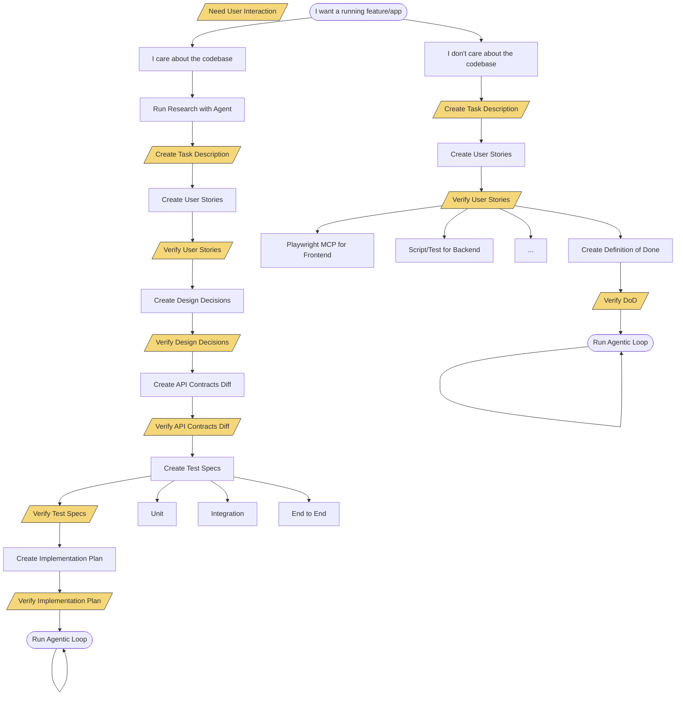

# Sahaidachny: Planning Document

**Project:** Claude Code Plugin for Autonomous Agentic Coding
**Status:** Design Phase
**Last Updated:** 2026-01-19

---

## Vision

An autonomous AI agent loop that navigates a hierarchy of specs (not just a flat PRD) to complete complex tasks across multiple context windows, maintaining state and learnings between iterations.

**Key differentiator from Ralph:** Hierarchical task structure with specialized skills for each planning and execution step.

---

## Reference: Ralph (snarktank/ralph)

Ralph is a bash-based automation loop that:
- Uses a flat `prd.json` with linear user stories
- Runs Amp (AI coding assistant) in iterations
- Maintains learnings in `progress.txt` (append-only)
- Each iteration is fresh context

### Ralph's Limitations We Address

| Aspect | Ralph | Sahaidachny |
|--------|-------|-------------|
| Spec Structure | Flat `prd.json` | Hierarchical markdown tree |
| Levels | Single (user stories) | Task → User Stories → Phases → Steps |
| Requirements | Inline in JSON | Rich `US-XXX.md` with acceptance criteria |
| Architecture | None | `DD-XXX.md` design decisions |
| Interfaces | None | `api-contracts/*.md` |
| Tests | Just "run tests" | Structured `test-specs/` with e2e/integration/unit |
| Execution | Priority order | Phased implementation with dependencies |
| Status | `passes: true/false` | Multi-level tracking |

---

## Task Structure (Reference: ai-assistant/docs/tasks)

```
task-XX/
├── README.md                    # Task status dashboard
├── task-description.md          # Architecture + technical overview
├── user-stories/
│   ├── US-001-feature-name.md   # Detailed requirements
│   ├── US-002-feature-name.md   # Acceptance criteria, edge cases
│   └── ...
├── design-decisions/
│   ├── README.md                # Index of decisions
│   ├── DD-001-decision-name.md  # Architecture decisions
│   └── ...
├── api-contracts/
│   ├── README.md                # Index of contracts
│   ├── component-a.md           # Interface definitions
│   └── ...
├── implementation-plan/
│   ├── README.md                # Phase status tracking
│   ├── phase-01-name.md         # Execution phases with steps
│   ├── phase-02-name.md
│   └── ...
├── test-specs/
│   ├── README.md                # Test overview
│   ├── environment-setup.md     # Test environment config
│   ├── e2e/                     # End-to-end test specs
│   ├── integration/             # Integration test specs
│   └── unit/                    # Unit test specs
└── research/
    ├── research-topic.md        # Technical research
    ├── api-schema.yaml          # External API specs
    └── diagrams/                # Visual artifacts
```

### Key Artifact Templates

Each artifact type follows a consistent template with:
- Metadata (status, priority, last updated)
- Cross-references to related artifacts
- Acceptance criteria or completion checklist

---

## Two-Phase Approach

### Phase 1: Planning (This Document's Focus)
Building the task documentation structure before execution.

### Phase 2: Execution
Running the agentic loop against the planned task structure.

---

## Planning Flow

Two modes based on user needs:

### Mode: Minimal ("I don't care about the codebase")
For greenfield projects or throwaway prototypes.

```
Create Task Description (user input)
    ↓
Create User Stories (auto-generated)
    ↓
Verify User Stories (user approval)
    ↓
Create Definition of Done (auto-generated)
    ↓
Verify DoD (user approval)
    ↓
Ready for Execution
```

### Mode: Full ("I care about the codebase")
For production codebases with existing patterns.

```
Run Research with Agent (auto)
    ↓
Create Task Description (user input)
    ↓
Create User Stories (auto-generated)
    ↓
Verify User Stories (user approval)
    ↓
Create Design Decisions (auto-generated)
    ↓
Verify Design Decisions (user approval)
    ↓
Create API Contracts Diff (auto-generated)
    ↓
Verify API Contracts (user approval)
    ↓
Create Test Specs (auto-generated)
    ↓
Verify Test Specs (user approval)
    ↓
Create Implementation Plan (auto-generated)
    ↓
Verify Implementation Plan (user approval)
    ↓
Ready for Execution
```

### Flow Diagram (Mermaid)



---

## Proposed Skills (Claude Code Plugin)

### Planning Phase Skills

| Skill | Purpose | Output |
|-------|---------|--------|
| `/saha:init` | Scaffold task folder structure | `task-XX/` directory tree |
| `/saha:research` | Deep codebase exploration | `research/*.md` |
| `/saha:task` | Interactive task description | `task-description.md`, `README.md` |
| `/saha:stories` | Generate user stories from task | `user-stories/US-XXX.md` |
| `/saha:decide` | Record design decisions | `design-decisions/DD-XXX.md` |
| `/saha:contracts` | Generate API contracts diff | `api-contracts/*.md` |
| `/saha:test-specs` | Generate test specifications | `test-specs/{e2e,int,unit}/*.md` |
| `/saha:plan` | Generate implementation phases | `implementation-plan/phase-XX.md` |
| `/saha:verify` | Interactive verification | Updates status in artifacts |
| `/saha:status` | Show planning progress | Terminal dashboard |

### Skill Flow

```
┌─────────────────────────────────────────────────────────────────────────┐
│                     SAHAIDACHNY PLANNING PHASE                          │
├─────────────────────────────────────────────────────────────────────────┤
│                                                                         │
│  /saha:init              Scaffold task folder structure          │
│                                                                         │
│  /saha:research          Deep codebase exploration               │
│       ↓                         → outputs research/*.md                 │
│  /saha:task              Interactive task description            │
│       ↓                         → outputs task-description.md, README   │
│  /saha:stories           Generate user stories from task         │
│       ↓                         → outputs user-stories/US-XXX.md        │
│  /saha:verify            Interactive verification (any artifact) │
│       ↓                         → uses Playwright/scripts/manual        │
│  /saha:decide            Record architectural decisions          │
│       ↓                         → outputs design-decisions/DD-XXX.md    │
│  /saha:contracts         Generate API contracts diff             │
│       ↓                         → outputs api-contracts/*.md            │
│  /saha:test-specs        Generate test specifications            │
│       ↓                         → outputs test-specs/{e2e,int,unit}     │
│  /saha:plan              Generate implementation phases          │
│       ↓                         → outputs implementation-plan/phase-XX  │
│  /saha:status            Show current planning progress          │
│                                                                         │
└─────────────────────────────────────────────────────────────────────────┘
```

---

## State Management

### State File Location

```
.sahaidachny/
├── state.yaml           # Current planning state
├── config.yaml          # Project-specific settings
└── templates/           # Custom templates (optional)
    ├── user-story.md.j2
    ├── api-contract.md.j2
    └── phase.md.j2
```

### State Schema

```yaml
# .sahaidachny/state.yaml
task_id: task-05
task_path: docs/tasks/task-05
mode: full  # or minimal
current_step: verify_stories

steps:
  research:
    status: completed
    completed_at: 2026-01-19T10:00:00Z
    artifacts:
      - research/mcp-design.md
      - research/api-schema.yaml

  task_description:
    status: completed
    completed_at: 2026-01-19T10:30:00Z
    artifacts:
      - task-description.md
      - README.md

  stories:
    status: completed
    completed_at: 2026-01-19T11:00:00Z
    artifacts:
      - user-stories/US-001-view-fines.md
      - user-stories/US-002-pay-fine.md

  verify_stories:
    status: in_progress
    started_at: 2026-01-19T11:30:00Z

  design_decisions:
    status: pending

  api_contracts:
    status: pending

  test_specs:
    status: pending

  implementation_plan:
    status: pending

learnings: []  # Accumulated insights for execution phase
```

---

## Progress Dashboard

```
/saha:status output:

Task-05: Fines Subagent
══════════════════════════════════════════════════════════════
Planning Progress:  ████████░░ 80%

✓ Research          research/mcp-design.md, research/api-schema.yaml
✓ Task Description  task-description.md
✓ User Stories      6/6 stories created
◐ Verify Stories    Awaiting approval
○ Design Decisions  0 decisions recorded
○ API Contracts     0/3 contracts defined
○ Test Specs        0/4 specs written
○ Implementation    0/5 phases planned

Current: /saha:verify stories
Next:    /saha:decide
══════════════════════════════════════════════════════════════
```

---

## Verification Toolkit

### Verification Methods

| Method | Use Case | Skill Flag |
|--------|----------|------------|
| Manual | User reviews and approves | `--manual` (default) |
| Playwright | Frontend UI verification | `--playwright` |
| Script | Run verification script | `--script=path/to/script.sh` |
| Test | Run existing tests | `--test` |

### Example Usage

```bash
/saha:verify stories              # Manual review of user stories
/saha:verify stories --playwright # Use Playwright MCP for UI stories
/saha:verify contracts --manual   # Manual API contract review
/saha:verify test-specs --test    # Run tests to verify specs
```

---

## Dependency Tracking

Track relationships between artifacts:

```yaml
# Stored in state or computed on-demand
dependencies:
  US-001-view-fines:
    affects:
      - api-contracts/fines-api.md
    tested_by:
      - test-specs/e2e/e2e-view-fines.md
      - test-specs/integration/int-fines-service.md
    implemented_in:
      - implementation-plan/phase-01-mock-server.md
      - implementation-plan/phase-04-subagent.md

  DD-001-notification-arch:
    affects:
      - implementation-plan/phase-02-notifications.md
      - implementation-plan/phase-03-service.md
    related_stories:
      - US-004-proactive-notification
```

---

## Iteration Support

Planning isn't always linear. Support going back:

```bash
/saha:revise stories    # Go back to stories after contract review
/saha:sync              # Propagate changes through dependent artifacts
```

When revising:
1. Mark dependent artifacts as "needs review"
2. Optionally auto-regenerate affected artifacts
3. Update state to reflect revision

---

## Next Steps

1. **Define Pydantic models** for task structure and state
2. **Implement `/saha:init`** scaffolding skill
3. **Implement state management** (`.sahaidachny/` folder)
4. **Implement `/saha:status`** dashboard
5. **Implement remaining planning skills**

---

## Open Questions

1. **Template customization:** How much flexibility for custom templates?
2. **Multi-task support:** Can we work on multiple tasks simultaneously?
3. **Git integration:** Auto-commit after each planning step?
4. **Collaboration:** How to handle multiple users on same task?

---

## References

- [Ralph (snarktank/ralph)](https://github.com/snarktank/ralph) - Reference implementation
- [ai-assistant/docs/tasks](../ai-assistant/docs/tasks) - Task structure reference
- [Claude Code Hooks](https://docs.anthropic.com/claude-code/hooks) - Plugin development

---

**Last Updated:** 2026-01-19
