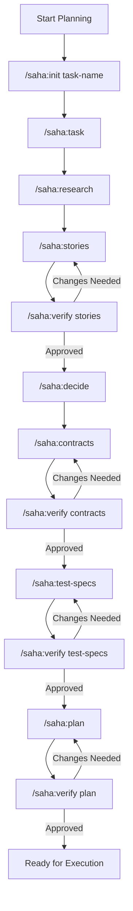

# Sahaidachny User Guide

**The Complete Guide to Planning and Executing Tasks with Sahaidachny**

> Named after [Petro Sahaidachny](https://en.wikipedia.org/wiki/Petro_Konashevych-Sahaidachny), the legendary Ukrainian Cossack hetman known for strategic planning and decisive execution.

---

## Table of Contents

1. [What is Sahaidachny?](#what-is-sahaidachny)
2. [Installation](#installation)
3. [Quick Start](#quick-start)
4. [Planning Phase](#planning-phase)
   - [Planning Modes](#planning-modes)
   - [Planning Commands](#planning-commands)
   - [Task Artifact Structure](#task-artifact-structure)
   - [Planning Workflow](#planning-workflow)
5. [Execution Phase](#execution-phase)
   - [Execution CLI Commands](#execution-cli-commands)
   - [The Agentic Loop](#the-agentic-loop)
   - [Execution Agents](#execution-agents)
   - [State Management](#state-management)
6. [Configuration](#configuration)
7. [Tools Integration](#tools-integration)
8. [Best Practices](#best-practices)
9. [Troubleshooting](#troubleshooting)

---

## What is Sahaidachny?

Sahaidachny is an autonomous AI agent orchestrator designed for hierarchical task execution in Claude Code. It solves a fundamental problem in AI-assisted coding: **how to reliably implement complex features that span multiple files, require architectural decisions, and need verification**.

### Core Capabilities

| Capability | Description |
|------------|-------------|
| **Structured Planning** | Build hierarchical task specifications (not flat PRDs) with user stories, design decisions, API contracts, and test specs |
| **Autonomous Execution** | Run agentic loops across multiple context windows that implement, verify, and iterate |
| **State Persistence** | Maintain learnings and progress between iterations, enabling resume after interruption |

### How It Differs from Simple AI Coding

| Aspect | Simple AI Coding | Sahaidachny |
|--------|------------------|-------------|
| Task structure | Single prompt | Hierarchical artifacts |
| Planning | Ad-hoc | Guided skill-based workflow |
| Implementation | One-shot | Iterative with feedback |
| Verification | Manual | Automated DoD checks |
| Quality | Hope for the best | Ruff, ty, complexity checks |
| State | Lost on context switch | Persisted to disk |

---

## Installation

### Prerequisites

- Python 3.11 or 3.12
- Claude Code CLI installed and configured

### Global Installation (Recommended)

Install Sahaidachny globally so you can use `saha` from anywhere:

#### Using pipx (Recommended)

```bash
# Install pipx if you don't have it
pip install --user pipx
pipx ensurepath

# Install from local directory
cd /path/to/sahaidachny
pipx install .

# Or specify the full path
pipx install /path/to/sahaidachny

# Verify installation
saha version
saha tools
```

#### Using uv tool

```bash
# Install uv if you don't have it
curl -LsSf https://astral.sh/uv/install.sh | sh

# Install from local directory
cd /path/to/sahaidachny
uv tool install .

# Verify installation
saha version
```

#### Using pip (user install)

```bash
# Install from local directory
pip install --user /path/to/sahaidachny

# Verify installation
saha version
```

#### Updating After Changes

If you modify the source code and want to update the installed version:

```bash
# Using pipx
pipx install --force /path/to/sahaidachny

# Using uv
uv tool install --force /path/to/sahaidachny
```

### Development Installation

For contributing or modifying Sahaidachny:

```bash
# Clone the repository
git clone <repo-url> sahaidachny
cd sahaidachny

# Create virtual environment and install in editable mode
python -m venv .venv
source .venv/bin/activate
pip install -e ".[dev,tools]"

# Verify installation
saha version
saha tools
```

### Using the Bootstrap Script (Alternative)

If you prefer not to install globally, use the bootstrap script:

```bash
cd sahaidachny

# Run via bootstrap script (auto-installs dependencies in local .venv)
./saha.sh run task-01
./saha.sh status
./saha.sh claude
```

### Installing the Claude Code Plugin

There are two ways to use the Sahaidachny plugin with Claude Code:

#### Option 1: Use `saha claude` (Recommended)

Launch Claude Code with the plugin automatically configured:

```bash
# Start Claude Code with Sahaidachny plugin
saha claude

# Or via bootstrap script
./saha.sh claude

# With additional Claude Code arguments
saha claude --resume
saha claude --dangerously-skip-permissions
```

This command:
- Adds the `claude_plugin/` directory to Claude's configuration
- Registers all planning commands (`/saha:*`)
- Registers execution agents for the agentic loop

#### Option 2: Manual Setup

Copy the plugin files to your project's Claude Code configuration:

```bash
# Create plugin directory (if not exists)
mkdir -p .claude/

# Copy commands
cp -r claude_plugin/commands/* .claude/commands/

# Copy agents
cp -r claude_plugin/agents/* .claude/agents/

# Copy templates and scripts
cp -r claude_plugin/templates .claude/
cp -r claude_plugin/scripts .claude/
```

Then start Claude Code normally:

```bash
claude
```

#### Verifying Plugin Installation

After starting Claude Code (either method), verify the plugin is loaded:

```
/help
```

You should see `/saha:init`, `/saha:status`, and other commands listed.

---

## Quick Start

**Tip:** Run `/sahaidachny` in Claude Code to see all available commands at any time.

### 1. Initialize a New Task

```bash
# In Claude Code, run:
/saha:init user-authentication --mode=full
```

This creates a task folder at `docs/tasks/task-01-user-authentication/`.

### 2. Define the Task (Planning)

```bash
# Define what you want to build
/saha:task

# Explore the codebase with task context (for existing projects)
/saha:research

# Generate user stories
/saha:stories

# Verify and approve
/saha:verify stories
```

### 3. Execute the Task

```bash
# Run the agentic loop
saha run task-01

# Or via bootstrap script
./saha.sh run task-01
```

### 4. Monitor Progress

```bash
# Check status
saha status task-01 --verbose
```

---

## Planning Phase

The Planning Phase is where you define **what** to build before the autonomous execution begins. Good planning leads to better execution.

### Planning Modes

Sahaidachny supports two planning modes based on your needs:

#### Minimal Mode (Greenfield Projects)

For new projects or throwaway prototypes where codebase context isn't critical:

```
Create Task Description (user input)
    ↓
Create User Stories (auto-generated)
    ↓
Verify User Stories (user approval)
    ↓
Create Definition of Done (auto-generated)
    ↓
Verify DoD (user approval)
    ↓
Ready for Execution
```

**Use when:**
- Starting from scratch
- Building a prototype
- Simple features without existing constraints

#### Full Mode (Production Codebases)

For existing codebases where patterns and architecture matter:

```
Create Task Description (user input)
    ↓
Run Research with Agent (auto, uses task as context)
    ↓
Create User Stories (auto-generated)
    ↓
Verify User Stories (user approval)
    ↓
Create Design Decisions (auto-generated)
    ↓
Verify Design Decisions (user approval)
    ↓
Create API Contracts Diff (auto-generated)
    ↓
Verify API Contracts (user approval)
    ↓
Create Test Specs (auto-generated)
    ↓
Verify Test Specs (user approval)
    ↓
Create Implementation Plan (auto-generated)
    ↓
Verify Implementation Plan (user approval)
    ↓
Ready for Execution
```

**Use when:**
- Working in an existing codebase
- Features that touch multiple components
- Changes that affect public APIs
- Features requiring integration tests

### Planning Commands

All planning commands are Claude Code slash commands prefixed with `/saha:`.

| Command | Purpose | Output |
|---------|---------|--------|
| `/saha:init` | Scaffold task folder structure | `task-XX/` directory tree |
| `/saha:research` | Deep codebase exploration | `research/*.md` documents |
| `/saha:task` | Interactive task description | `task-description.md`, `README.md` |
| `/saha:stories` | Generate user stories from task | `user-stories/US-XXX.md` (multiple) |
| `/saha:decide` | Record design decisions | `design-decisions/DD-XXX.md` |
| `/saha:contracts` | Generate API contracts diff | `api-contracts/*.md` |
| `/saha:test-specs` | Generate test specifications | `test-specs/{e2e,int,unit}/*.md` |
| `/saha:plan` | Generate implementation phases | `implementation-plan/phase-XX.md` |
| `/saha:verify` | Interactive verification | Updates status in artifacts |
| `/saha:status` | Show planning progress | Terminal dashboard |

#### Command Details

##### `/saha:init`

Creates the initial folder structure for a new task.

```bash
/saha:init <task-name> [--mode=full|minimal] [--path=docs/tasks]
```

**Arguments:**
- `task-name` (required): Short descriptive name for the task
- `--mode`: Planning mode (default: `full`)
- `--path`: Base path for tasks (default: `docs/tasks`)

**Examples:**
```bash
/saha:init user-authentication
/saha:init payment-integration --mode=minimal
/saha:init api-refactor --path=planning/tasks
```

##### `/saha:research`

Explores the codebase to understand existing patterns, conventions, and architecture.

```bash
/saha:research [topic]
```

**Output:** Research documents in `{task}/research/` containing:
- Code patterns and conventions
- Relevant existing implementations
- Dependencies and integrations
- Technical constraints

##### `/saha:task`

Interactive session to define the task description.

```bash
/saha:task
```

**Output:** `task-description.md` containing:
- Problem statement
- Proposed solution
- Technical scope (in/out)
- Success criteria
- Constraints and assumptions

##### `/saha:stories`

Generates user stories based on the task description.

```bash
/saha:stories
```

**Output:** Multiple `user-stories/US-XXX-{slug}.md` files with:
- User story format (As a... I want... So that...)
- Acceptance criteria (Given/When/Then)
- Edge cases
- Dependencies

##### `/saha:verify`

Interactive verification of any artifact type.

```bash
/saha:verify <artifact-type> [--method]
```

**Artifact types:** `stories`, `decisions`, `contracts`, `test-specs`, `plan`

**Verification methods:**
- `--manual` (default): User reviews and approves
- `--playwright`: Use Playwright MCP for UI verification
- `--script=<path>`: Run a verification script
- `--test`: Run existing tests

**Examples:**
```bash
/saha:verify stories              # Manual review of user stories
/saha:verify stories --playwright # UI verification
/saha:verify contracts --manual   # API contract review
```

##### `/saha:status`

Shows the current planning progress dashboard.

```bash
/saha:status
```

**Example output:**
```
Task-05: Fines Subagent
══════════════════════════════════════════════════════════════
Planning Progress:  ████████░░ 80%

✓ Research          research/mcp-design.md, research/api-schema.yaml
✓ Task Description  task-description.md
✓ User Stories      6/6 stories created
◐ Verify Stories    Awaiting approval
○ Design Decisions  0 decisions recorded
○ API Contracts     0/3 contracts defined
○ Test Specs        0/4 specs written
○ Implementation    0/5 phases planned

Current: /saha:verify stories
Next:    /saha:decide
══════════════════════════════════════════════════════════════
```

### Task Artifact Structure

After initialization, your task folder will have this structure:

```
docs/tasks/task-XX-{name}/
├── README.md                    # Task status dashboard
├── task-description.md          # Technical overview & scope
├── user-stories/
│   ├── README.md               # Story index
│   └── US-XXX-{slug}.md        # Individual stories
├── design-decisions/
│   ├── README.md               # Decision index
│   └── DD-XXX-{name}.md        # Architecture decisions
├── api-contracts/
│   ├── README.md               # Contract index
│   └── {component}.md          # Interface definitions
├── implementation-plan/
│   ├── README.md               # Phase overview & timeline
│   └── phase-XX-{name}.md      # Execution phases with steps
├── test-specs/
│   ├── README.md               # Test overview
│   ├── e2e/                    # End-to-end test specs
│   ├── integration/            # Integration test specs
│   └── unit/                   # Unit test specs
└── research/
    └── *.md                    # Technical research documents
```

#### Artifact Templates

##### User Story Template

```markdown
# US-XXX: [Short Title]

**Priority:** Must Have | Should Have | Could Have
**Status:** Draft | Ready | Approved
**Persona:** [User type]
**Estimated Complexity:** S | M | L | XL

## User Story

As a **[persona]**,
I want to **[action]**,
So that **[benefit]**.

## Acceptance Criteria

1. **Given** [initial context]
   **When** [action taken]
   **Then** [expected outcome]

2. **Given** [context 2]
   **When** [action 2]
   **Then** [outcome 2]

## Edge Cases

1. **[Edge case name]**
   - Trigger: [what causes this]
   - Expected behavior: [what should happen]

## Dependencies

- **Requires:** [stories this depends on]
- **Enables:** [stories that depend on this]
```

##### Design Decision Template

```markdown
# DD-XXX: [Decision Name]

**Status:** Proposed | Accepted | Deprecated
**Date:** YYYY-MM-DD

## Context

[Why this decision needs to be made]

## Decision

[What we're choosing to do]

## Alternatives Considered

1. **[Alternative 1]**
   - Pros: ...
   - Cons: ...

2. **[Alternative 2]**
   - Pros: ...
   - Cons: ...

## Consequences

- [Positive/negative implications]
- [Trade-offs accepted]

## Related

- Affects: [US-XXX, US-YYY]
- Implementation: [Phase XX]
```

##### Implementation Phase Template

```markdown
# Phase XX: [Phase Name]

**Status:** Not Started | In Progress | Complete
**Estimated Effort:** S | M | L | XL
**Dependencies:** [Previous phase]

## Objective

[What this phase accomplishes]

## Scope

### Stories Included

| Story | Priority | Complexity |
|-------|----------|------------|
| US-001 | Must Have | M |
| US-002 | Should Have | S |

### Out of Scope (Deferred)

- [Deferred story] (Phase YY)

## Implementation Steps

### Step 1: [Component Name]

**Description:** [What to build]

**Files to Create/Modify:**
- `path/to/file.py` - [Purpose]

**Acceptance Criteria:**
- [ ] [Verifiable outcome 1]
- [ ] [Verifiable outcome 2]

## Definition of Done

Phase is complete when:
- [ ] All stories implemented
- [ ] All tests passing
- [ ] Code reviewed

## Risks

| Risk | Likelihood | Impact | Mitigation |
|------|------------|--------|------------|
| [Risk 1] | Medium | High | [Mitigation] |
```

### Planning Workflow

#### Typical Full-Mode Workflow



#### Tips for Effective Planning

1. **Define the task first** - A clear task description gives research context and focus
2. **Keep stories small** - Each story should be implementable in one iteration
3. **Define clear acceptance criteria** - Vague criteria lead to endless iterations
4. **Capture edge cases explicitly** - Edge cases are where bugs hide
5. **Link dependencies** - Know what blocks what before execution starts

---

## Execution Phase

The Execution Phase is where Sahaidachny autonomously implements your planned task through an iterative agentic loop.

### Execution CLI Commands

The `saha` CLI provides commands to run and monitor task execution.

#### `saha run` - Execute a Task

```bash
saha run <task-id> [OPTIONS]
```

**Arguments:**
- `task-id` (required): Task identifier (e.g., `task-01`)

**Options:**
| Option | Short | Description |
|--------|-------|-------------|
| `--path` | `-p` | Path to task folder (default: `docs/tasks/<task_id>`) |
| `--max-iter` | `-m` | Maximum iterations (default: 10) |
| `--tools` | `-t` | Comma-separated enabled tools |
| `--playwright` | | Enable Playwright for UI verification |
| `--dry-run` | | Simulate without making changes |
| `--verbose` | `-v` | Enable verbose logging |

**Examples:**
```bash
# Basic run
saha run task-01

# With options
saha run task-01 --max-iter 15 --verbose
saha run task-01 --tools ruff,pytest,ty
saha run task-01 --playwright --path custom/path/task-01
saha run task-01 --dry-run
```

#### `saha resume` - Resume Interrupted Execution

```bash
saha resume <task-id> [--verbose]
```

Resumes a previously interrupted task from where it left off.

**Example:**
```bash
saha resume task-01 --verbose
```

#### `saha status` - Check Execution Status

```bash
saha status [task-id] [--verbose]
```

**Without task-id:** Lists all tasks with saved execution state.

**With task-id:** Shows detailed status for a specific task.

**Examples:**
```bash
# List all tasks
saha status

# Detailed status for one task
saha status task-01 --verbose
```

**Example output:**
```
Task: task-01
Phase: CODE_QUALITY
Iteration: 3/10
Started: 2026-01-22 10:30:00
Completed: N/A

Iterations:
  1: DoD=False, Quality=N/A
  2: DoD=True, Quality=False
  3: DoD=True, Quality=True
```

#### `saha tools` - List Available Tools

```bash
saha tools
```

Shows all registered tools and their availability:
```
Registered tools:
  ✓ ruff
  ✓ ty
  ✓ complexity
  ✓ pytest
```

#### `saha clean` - Remove Execution State

```bash
saha clean [task-id] [--all]
```

**Examples:**
```bash
# Clean specific task
saha clean task-01

# Clean all task states
saha clean --all
```

### The Agentic Loop

The agentic loop is the core execution mechanism. It iteratively implements, verifies, and improves code until the task is complete.

#### Loop Flow Diagram

```
Start Iteration
    │
    ▼
┌─────────────────────────┐
│ Phase 1: IMPLEMENTATION │
│ • Read task artifacts   │
│ • Write/modify code     │
│ • Return files changed  │
└───────────┬─────────────┘
            │
            ▼
┌─────────────────────────┐
│ Phase 2: QA             │
│ • Verify DoD criteria   │
│ • Run tests             │
│ • Check acceptance      │
└───────────┬─────────────┘
            │
     DoD achieved?
        │      │
       No     Yes
        │      │
        │      ▼
        │  ┌─────────────────────────┐
        │  │ Phase 3: CODE_QUALITY   │
        │  │ • Run Ruff (linting)    │
        │  │ • Run ty (type check)   │
        │  │ • Check complexity      │
        │  └───────────┬─────────────┘
        │              │
        │       Quality passed?
        │          │      │
        │         No     Yes
        │          │      │
        ├──────────┘      ▼
        │          ┌─────────────────────────┐
        │          │ Phase 4: MANAGER        │
        │          │ • Update task artifacts │
        │          │ • Mark completed items  │
        │          └───────────┬─────────────┘
        │                      │
        │                      ▼
        │          ┌─────────────────────────┐
        │          │ Phase 5: DOD_CHECK      │
        │          │ • Check all stories     │
        │          │ • Check all phases      │
        │          │ • Decide if complete    │
        │          └───────────┬─────────────┘
        │                      │
        │               Task complete?
        │                  │      │
        │                 No     Yes
        │                  │      │
        └──────────────────┘      ▼
                              COMPLETED

(When No: loop back with fix_info for next iteration)
```

#### Loop Phases

| Phase | Purpose | Agent |
|-------|---------|-------|
| `IMPLEMENTATION` | Write code according to plan | Implementation Agent |
| `QA` | Verify Definition of Done met | QA Agent |
| `CODE_QUALITY` | Check linting, types, complexity | Code Quality Agent |
| `MANAGER` | Update task artifact status | Manager Agent |
| `DOD_CHECK` | Check if entire task complete | DoD Agent |

#### What Happens on Failure

When QA or Code Quality fails:
1. The failing phase generates `fix_info` - specific feedback about what's wrong
2. `fix_info` is passed to the next iteration's Implementation Agent
3. The Implementation Agent reads the feedback and makes targeted fixes
4. The loop continues until success or max iterations reached

**Example fix_info:**
```
The implementation fails 2 acceptance criteria:

1. **Email validation missing** (user-stories/US-001.md:AC-3)
   - Location: src/forms/contact.py:42
   - Issue: No regex validation on email field
   - Fix: Add email pattern validation before submission

2. **Error message not displayed** (user-stories/US-001.md:AC-5)
   - Location: templates/contact.html:28
   - Issue: Error div is present but has no content
   - Fix: Pass form.errors to template context
```

### Execution Agents

The execution phase uses five specialized Claude Code subagents:

#### 1. Implementation Agent

**Purpose:** Write high-quality code that implements planned features.

**Responsibilities:**
- Read task artifacts to understand requirements
- Identify current phase/step to implement
- Analyze fix_info from previous failed iterations
- Write minimal, focused code changes
- Follow existing codebase patterns

**Guidelines:**
- Functions < 50 lines
- Single responsibility principle
- Pydantic v2 for data models
- Type hints on all functions
- Imports at module level (never inside functions)

**Output format:**
```json
{
  "status": "success",
  "files_changed": ["src/auth.py", "src/models.py"],
  "files_added": ["src/validators.py"],
  "summary": "Added email validation and error handling",
  "next_steps": "Run tests to verify validation works"
}
```

#### 2. QA Agent

**Purpose:** Verify that implementations meet Definition of Done criteria.

**Responsibilities:**
- Build verification checklist from user stories
- Run automated tests (pytest)
- Execute verification scripts
- Check acceptance criteria systematically
- Provide actionable fix_info when failures occur

**Output format:**
```json
{
  "dod_achieved": false,
  "checks": [
    {"criterion": "User can submit form", "passed": true},
    {"criterion": "Validation shows errors", "passed": false}
  ],
  "test_results": {"total": 10, "passed": 8, "failed": 2},
  "fix_info": "Email validation is missing in form.py:42"
}
```

#### 3. Code Quality Agent

**Purpose:** Ensure code meets quality standards.

**Responsibilities:**
- Run Ruff (linting and style)
- Run ty (type checking)
- Run complexipy (complexity analysis)
- Filter false positives and pre-existing issues
- Only fail for genuine problems in changed code

**Output format:**
```json
{
  "quality_passed": true,
  "issues": [],
  "files_analyzed": ["src/auth.py"],
  "blocking_issues_count": 0,
  "ignored_issues_count": 3
}
```

#### 4. Manager Agent

**Purpose:** Update task artifact status after successful iterations.

**Responsibilities:**
- Mark completed items in implementation plan
- Update user story status
- Record iteration numbers
- Track progress in README files

#### 5. DoD (Definition of Done) Agent

**Purpose:** Determine if the entire task is complete.

**Responsibilities:**
- Count user stories (total vs done)
- Check implementation phase status
- Verify all acceptance criteria met
- Make final completion decision

**Output format:**
```json
{
  "task_complete": false,
  "confidence": "high",
  "summary": {
    "user_stories_total": 5,
    "user_stories_done": 3,
    "phases_total": 3,
    "phases_done": 2
  },
  "remaining_items": ["US-004", "US-005", "Phase 3"],
  "recommendation": "Continue with remaining user stories"
}
```

### State Management

Execution state is persisted to disk, enabling:
- Resume after interruption
- Progress tracking
- Debugging and analysis

#### State Location

```
.sahaidachny/
├── task-01-execution-state.yaml
├── task-02-execution-state.yaml
└── config.yaml
```

#### State Schema

```yaml
task_id: task-01
task_path: docs/tasks/task-01
current_phase: CODE_QUALITY
current_iteration: 3
max_iterations: 10
started_at: 2026-01-22T10:30:00
completed_at: null

enabled_tools:
  - ruff
  - ty
  - complexity
  - pytest

iterations:
  - iteration: 1
    started_at: 2026-01-22T10:30:00
    completed_at: 2026-01-22T10:35:00
    dod_achieved: false
    quality_passed: false
    fix_info: "Missing email validation"

  - iteration: 2
    started_at: 2026-01-22T10:35:00
    completed_at: 2026-01-22T10:40:00
    dod_achieved: true
    quality_passed: false
    fix_info: "Type error in auth.py:42"

  - iteration: 3
    started_at: 2026-01-22T10:40:00
    completed_at: null
    dod_achieved: true
    quality_passed: true

context:
  fix_info: null
```

---

## Configuration

Sahaidachny uses Pydantic Settings for configuration with environment variable support.

### Configuration Methods

1. **Environment variables** (prefix: `SAHA_`)
2. **`.env` file** in project root
3. **Command-line options** (override settings)

### Main Settings

| Setting | Env Variable | Default | Description |
|---------|--------------|---------|-------------|
| `state_dir` | `SAHA_STATE_DIR` | `.sahaidachny` | State persistence directory |
| `task_base_path` | `SAHA_TASK_BASE_PATH` | `docs/tasks` | Base folder for task artifacts |
| `max_iterations` | `SAHA_MAX_ITERATIONS` | `10` | Default max loop iterations |
| `runner` | `SAHA_RUNNER` | `claude` | Runner type: `claude` or `mock` |
| `claude_model` | `SAHA_CLAUDE_MODEL` | `claude-sonnet-4-20250514` | Claude model to use |
| `verbose` | `SAHA_VERBOSE` | `false` | Enable verbose logging |
| `dry_run` | `SAHA_DRY_RUN` | `false` | Simulate without changes |

### Tool Configuration

| Setting | Env Variable | Default | Description |
|---------|--------------|---------|-------------|
| `ruff_enabled` | `SAHA_TOOL_RUFF_ENABLED` | `true` | Enable Ruff linting |
| `ty_enabled` | `SAHA_TOOL_TY_ENABLED` | `true` | Enable ty type checking |
| `complexity_enabled` | `SAHA_TOOL_COMPLEXITY_ENABLED` | `true` | Enable complexity checking |
| `complexity_threshold` | `SAHA_TOOL_COMPLEXITY_THRESHOLD` | `15` | Max cognitive complexity |
| `pytest_enabled` | `SAHA_TOOL_PYTEST_ENABLED` | `true` | Enable pytest runner |

### Hook Configuration

| Setting | Env Variable | Default | Description |
|---------|--------------|---------|-------------|
| `ntfy_enabled` | `SAHA_HOOK_NTFY_ENABLED` | `true` | Enable ntfy notifications |
| `ntfy_topic` | `SAHA_HOOK_NTFY_TOPIC` | `sahaidachny` | ntfy topic name |
| `ntfy_server` | `SAHA_HOOK_NTFY_SERVER` | `https://ntfy.sh` | ntfy server URL |

### Example `.env` File

```bash
# Runner configuration
SAHA_RUNNER=claude
SAHA_CLAUDE_MODEL=claude-sonnet-4-20250514
SAHA_MAX_ITERATIONS=15

# Tool settings
SAHA_TOOL_COMPLEXITY_THRESHOLD=20
SAHA_TOOL_PYTEST_ENABLED=false

# Notifications
SAHA_HOOK_NTFY_ENABLED=true
SAHA_HOOK_NTFY_TOPIC=my-project
```

---

## Tools Integration

Sahaidachny integrates with external code quality tools to verify implementations.

### Available Tools

#### Ruff (Linting)

Fast Python linter written in Rust.

**What it checks:**
- Code style and formatting
- Import sorting
- Common errors and anti-patterns
- PEP 8 compliance

**Configuration:** Uses project's `pyproject.toml` or `ruff.toml`

#### ty (Type Checking)

Astral's fast Python type checker.

**What it checks:**
- Type annotation correctness
- Missing type hints
- Type mismatches

**Modes:**
- Normal: Standard type checking
- Strict: Additional strictness rules

#### Complexipy (Complexity)

Cognitive complexity analyzer.

**What it measures:**
- Function cognitive complexity
- Flags functions above threshold

**Default threshold:** 15 (configurable)

#### Pytest (Testing)

Python test framework runner.

**What it does:**
- Runs test suite
- Reports pass/fail counts
- Captures failure details

### Checking Tool Availability

```bash
saha tools
```

Output:
```
Registered tools:
  ✓ ruff
  ✓ ty
  ✓ complexity
  ✗ pytest  (not installed)
```

### Selective Tool Usage

You can enable specific tools per run:

```bash
# Only ruff and ty
saha run task-01 --tools ruff,ty

# All tools except pytest
saha run task-01 --tools ruff,ty,complexity
```

---

## Best Practices

### Planning Phase Best Practices

1. **Define the task clearly before research**
   - A good task description gives the research agent context
   - This leads to more focused, relevant research findings

2. **Write small, focused user stories**
   - Each story should be completable in 1-3 iterations
   - Large stories lead to complex failures

3. **Be specific in acceptance criteria**
   - "User sees error message" is vague
   - "Error message 'Invalid email format' appears below email field" is specific

4. **Document edge cases explicitly**
   - What happens with empty input?
   - What happens with very long input?
   - What happens when external service is down?

5. **Create clear dependencies**
   - Know which stories must complete before others
   - Plan phases to respect dependencies

### Execution Phase Best Practices

1. **Start with low max-iterations for new tasks**
   ```bash
   saha run task-01 --max-iter 5
   ```
   Review results before allowing more iterations.

2. **Use verbose mode for debugging**
   ```bash
   saha run task-01 --verbose
   ```
   See detailed logs of what each agent is doing.

3. **Review fix_info between iterations**
   Check the state file to understand why iterations are failing.

4. **Clean up between unrelated runs**
   ```bash
   saha clean task-01
   ```
   Fresh state prevents confusion from stale context.

5. **Enable only needed tools**
   If your project doesn't use types, disable ty:
   ```bash
   saha run task-01 --tools ruff,complexity
   ```

### Code Quality Best Practices

1. **Configure complexity threshold appropriately**
   - Default 15 is reasonable for most projects
   - Increase for complex domains (parsers, compilers)

2. **Fix pre-existing issues separately**
   - Don't let existing tech debt block new features
   - The Code Quality Agent filters pre-existing issues

3. **Trust the tools**
   - If Ruff complains, there's usually a good reason
   - Fix issues rather than ignoring them

---

## Troubleshooting

### Common Issues

#### "No saved state found for task"

**Cause:** Running `saha resume` before `saha run`.

**Solution:** Use `saha run task-01` to start the task first.

#### "Task path does not exist"

**Cause:** Task folder wasn't created or path is wrong.

**Solution:**
1. Run `/saha:init task-name` to create the folder
2. Or specify correct path: `saha run task-01 --path path/to/task`

#### "Max iterations reached"

**Cause:** Task couldn't complete within iteration limit.

**Solutions:**
1. Increase limit: `saha run task-01 --max-iter 20`
2. Review `fix_info` in state file to understand why it's failing
3. Simplify user stories if they're too complex

#### "Runner 'claude' is not available"

**Cause:** Claude Code CLI not installed or not in PATH.

**Solution:**
1. Install Claude Code CLI
2. Verify: `claude --version`
3. Or use mock runner for testing: `SAHA_RUNNER=mock saha run task-01`

#### QA Always Failing

**Cause:** Acceptance criteria too vague or implementation doesn't match.

**Solutions:**
1. Review and clarify acceptance criteria
2. Check if implementation actually addresses the criteria
3. Look at fix_info for specific feedback

#### Code Quality Always Failing

**Cause:** Many linting/type issues in changes.

**Solutions:**
1. Check the specific issues in fix_info
2. Consider if complexity threshold is appropriate
3. Fix type annotations if ty is failing

### Getting Help

1. Check `saha status task-01 --verbose` for detailed state
2. Read the state YAML file directly: `.sahaidachny/task-01-execution-state.yaml`
3. Enable verbose logging: `saha run task-01 --verbose`
4. Use dry-run to test without changes: `saha run task-01 --dry-run`

### Resetting State

If state becomes corrupted or you want a fresh start:

```bash
# Clean specific task
saha clean task-01

# Clean everything
saha clean --all
```

---

## Appendix: Command Reference

### Planning Commands (Claude Code)

```
/sahaidachny                   # Show all commands and current status (helper)
/saha:init <name> [--mode=full|minimal] [--path=docs/tasks]
/saha:research [topic]
/saha:task
/saha:stories
/saha:decide
/saha:contracts
/saha:test-specs
/saha:plan
/saha:verify <artifact-type> [--method]
/saha:status
```

**Tip:** Type `/sahaidachny` to see all available commands and quick status.

### Execution Commands (saha CLI)

```
saha claude [args...] [-p plugin-path]    # Launch Claude Code with plugin
saha plugin [--copy-to <dir>]             # Show plugin location or copy files
saha run <task-id> [-p path] [-m max-iter] [-t tools] [--playwright] [--dry-run] [-v]
saha resume <task-id> [-v]
saha status [task-id] [-v]
saha tools
saha clean [task-id] [--all]
saha version
```

### Environment Variables

```
SAHA_STATE_DIR=.sahaidachny
SAHA_TASK_BASE_PATH=docs/tasks
SAHA_MAX_ITERATIONS=10
SAHA_RUNNER=claude
SAHA_CLAUDE_MODEL=claude-sonnet-4-20250514
SAHA_VERBOSE=false
SAHA_DRY_RUN=false
SAHA_TOOL_RUFF_ENABLED=true
SAHA_TOOL_TY_ENABLED=true
SAHA_TOOL_COMPLEXITY_ENABLED=true
SAHA_TOOL_COMPLEXITY_THRESHOLD=15
SAHA_TOOL_PYTEST_ENABLED=true
SAHA_HOOK_NTFY_ENABLED=true
SAHA_HOOK_NTFY_TOPIC=sahaidachny
SAHA_HOOK_NTFY_SERVER=https://ntfy.sh
```

---

**Last Updated:** 2026-01-22
